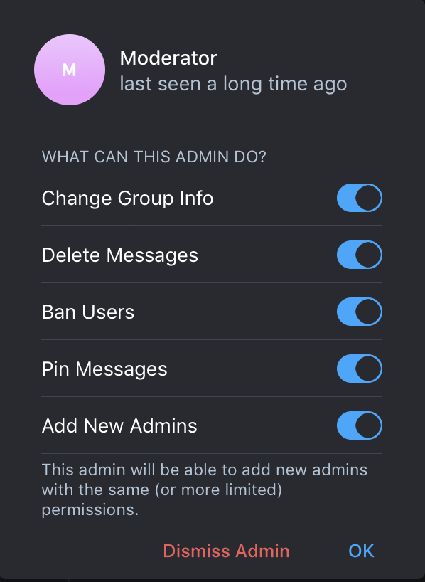

# User's Guide

## Telegram Moderator Bot
This Telegram Moderator Bot is capable of adding moderators to Telegram supergroups.
Regular groups and channels are not supported.

### How to set it up
1. Talk to the @BotFather and create a bot on Telegram.
1. Deploy the using the tutorial at [README.md](freshautomations/telegram-moderator-bot/blob/master/README.md)
1. Invite your bot to your Telegram supergroup.
1. Make your bot Full Administrator on the supergroup. It looks like this:


## Moderators
Moderators are supergroup administrators with some modified privileges. Moderators can **delete a message**
and **pin a message** using the built-in GUI functionality. No other usual admin functions are necessary
(or encouraged) for moderators. It is explicitly forbidden to give a moderator the
"Ban users" and "Add new Admins" privileges. These privileges would allow them to have power over other moderators.

Above the mentioned administrative privileges, moderators can issue the `/ban @username` command to the Telegram Bot
to ban a regular member of the supergroup. Moderators can unban users using the GUI interface or the `/unban @username` command.
(The user has to rejoin the group after unbanning.)

## (Full) Administrators
Administrators have more privileges than moderators. For the Telegram bot, any administrator with the "Add new Admins"
privilege is considered a "Full" administrator. The creator of the supergroup is also considered a Full administrator.
Full administrators can issue the `/promote @username` and `/demote @username` commands to appoint new moderators
or remove current moderators.

## Restrictions
The bot will only "know" a user if the user has sent at least one message on the channel.

This means that to promote a user to moderator status, the user has to say "Hi" at least on the channel.

## List of commands for moderators (and administrators)

```
/hello
```
A nice welcome message. It only works if you're a moderator or administrator so you can check your privileges.

```
/list
```
Lists moderators.

```
/ban @username
```
Ban a user. Use the GUI to quickly pinpoint the user and fill in the right username.
Administrators and other moderators cannot be banned.

Multiple names can be added with space separation.

```
/unban @username
```
Removes the user from the banned list. Does not add the user back in the supergroup.
(This can be achieved on the GUI too, this is only for convenience.)

Multiple names can be added with space separation.

## List of commands for administrators only

```
/promote @username
```
Give a regular user moderator privileges. Current moderators and administrators will be unaffected.

Multiple names can be added with space separation.

```
/demote @username
```
Take away administrative privileges from a moderator. The creator user or full administrators
(administrators with the "Add new Admins" privilege) will be unaffected.

Multiple names can be added with space separation.
